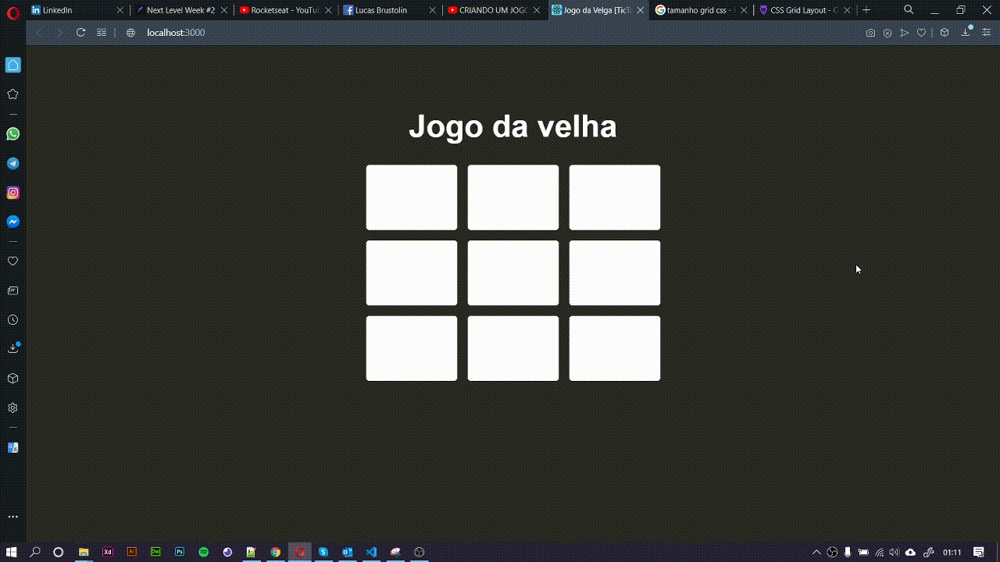

# Jogo-da-velha-com-React
Bora criar um web app de #?? jogo da velha, utilizando ?? React & ? React Hooks! ??

### `yarn start`

Runs the app in the development mode. 
Open [http://localhost:3000](http://localhost:3000) to view it in the browser.

The page will reload if you make edits. 
You will also see any lint errors in the console.

#Referência

###### Lucas Caton 
https://www.youtube.com/watch?v=kFXDcaUcOto&feature=youtu.be
